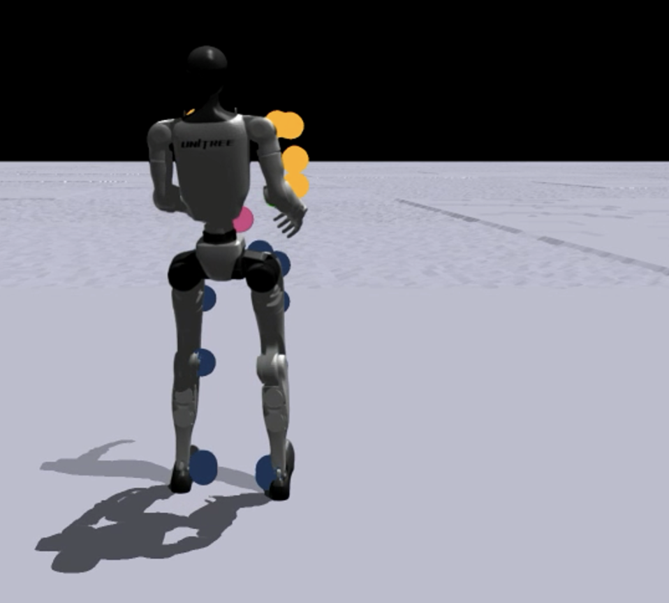
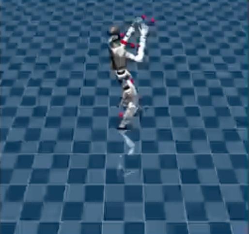
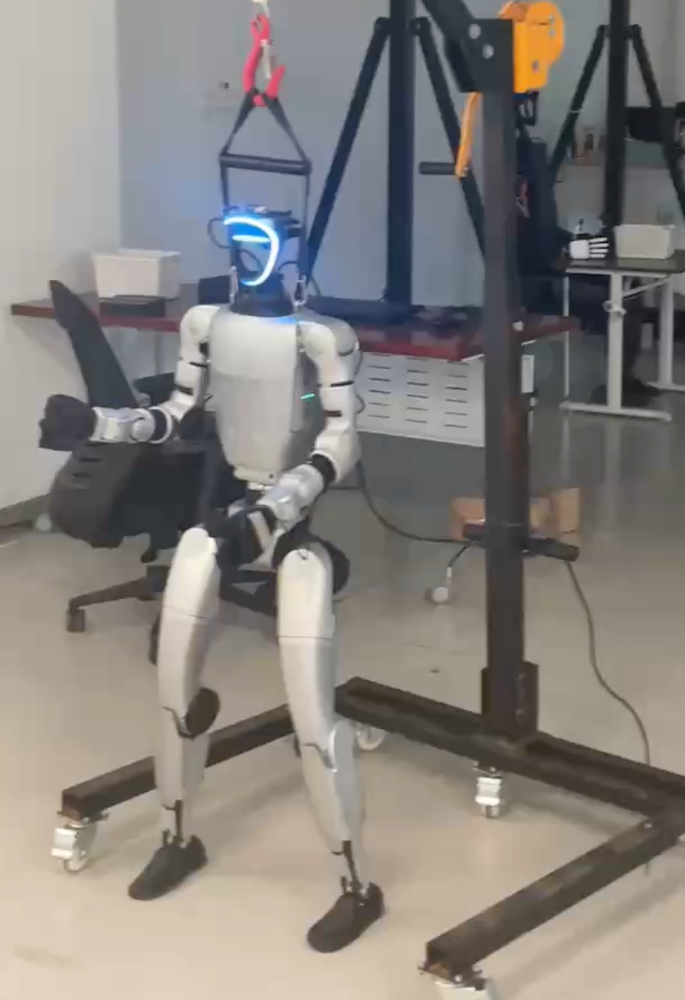

# Humanoid-Teleoperation-Human-Motion-Capture
The project is the final project of SI252 for the reinforcement learning course plans to use reinforcement learning to remotely operate humanoid robots based on real-time motion capture. I will use existing real-time motion capture algorithms to capture human movements, retarget the robots, and train them in a simulated environment and reinforcement learning to perform actions similar to those of humans.

# Plans
- [X] Proposal & Mocap method
- [X] Code prepare
- [X] Train baseline RL method human2humanoid
- [X] Sim2sim simulation
- [X] Sim2Real deployment

# Sim2Sim Results
](vids/16346.MP4)
](vids/16437.MP4)

# Sim2Real Results
](vids/sd1746686806_2.MP4)